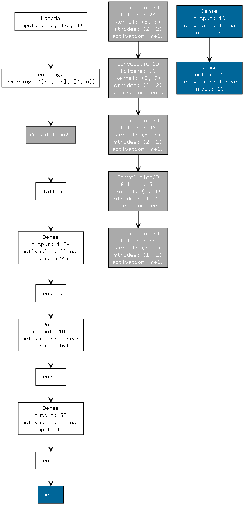
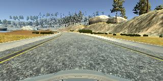
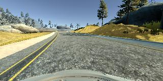
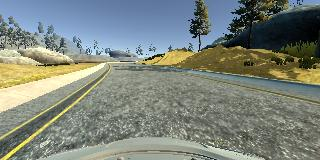
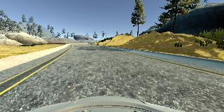
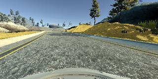
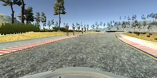
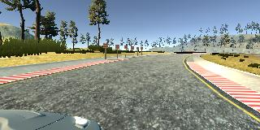
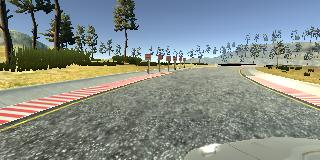
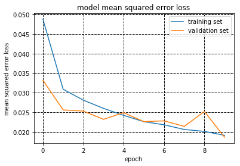

# **Behavioral Cloning** 

### Files Submitted & Code Quality

#### 1. Submission includes all required files and can be used to run the simulator in autonomous mode

My project includes the following files:
* `model.py` containing the script to create and train the model
* `drive.py` for driving the car in autonomous mode
* `model.h5` containing a trained convolution neural network 
* `writeup_report.md` or `writeup_report.pdf` summarizing the results

#### 2. Submission includes functional code
Using the Udacity provided simulator and my `drive.py` file, the car can be driven autonomously around the track by executing 
```sh
python drive.py model.h5
```

#### 3. Submission code is usable and readable

The `model.py` file contains the code for training and saving the convolution neural network. The file shows the pipeline I used for training and validating the model, and it contains comments to explain how the code works.

### Model Architecture and Training Strategy

#### 1. An appropriate model architecture has been employed

[My first model]((https://github.com/jeongwhanchoi/CarND-Behavioral-Cloning/blob/0038f7d0bd08b932d629f4ed7d5039d2997b2658/clone.py#L46-L57) ) was based on [LeNet](http://yann.lecun.com/exdb/lenet/), but it was not good enough to run the simulator in autonomous mode. I try a network architecture publisihed by [NVIDIA Autonomous Car Team](https://devblogs.nvidia.com/parallelforall/deep-learning-self-driving-cars/) that is even more powerful than the LeNet model.


This above is the network they use for training real car to drive autonomously.

Starting from the bottom, the network consists of a normalization layer which I already have, followed by five convolutional layers, four fully connected layers.

Using this network as [my final model](https://github.com/jeongwhanchoi/CarND-Behavioral-Cloning/blob/d602d8353fe85fd28bc387dbe1c07646f7a6d5ae/model.py#L67-L83), the agent in the simulator can drive around track one without leaving the road. 

[My final model](https://github.com/jeongwhanchoi/CarND-Behavioral-Cloning/blob/d602d8353fe85fd28bc387dbe1c07646f7a6d5ae/model.py#L67-L83) summary is as follows:

```
____________________________________________________________________________________________________
Layer (type)                     Output Shape          Param #     Connected to                     
====================================================================================================
lambda_1 (Lambda)                (None, 160, 320, 3)   0           lambda_input_2[0][0]             
____________________________________________________________________________________________________
cropping2d_1 (Cropping2D)        (None, 85, 320, 3)    0           lambda_1[0][0]                   
____________________________________________________________________________________________________
convolution2d_1 (Convolution2D)  (None, 41, 158, 24)   1824        cropping2d_1[0][0]               
____________________________________________________________________________________________________
convolution2d_2 (Convolution2D)  (None, 19, 77, 36)    21636       convolution2d_1[0][0]            
____________________________________________________________________________________________________
convolution2d_3 (Convolution2D)  (None, 8, 37, 48)     43248       convolution2d_2[0][0]            
____________________________________________________________________________________________________
convolution2d_4 (Convolution2D)  (None, 6, 35, 64)     27712       convolution2d_3[0][0]            
____________________________________________________________________________________________________
convolution2d_5 (Convolution2D)  (None, 4, 33, 64)     36928       convolution2d_4[0][0]            
____________________________________________________________________________________________________
flatten_1 (Flatten)              (None, 8448)          0           convolution2d_5[0][0]            
____________________________________________________________________________________________________
dense_1 (Dense)                  (None, 1164)          9834636     flatten_1[0][0]                  
____________________________________________________________________________________________________
dropout_1 (Dropout)              (None, 1164)          0           dense_1[0][0]                    
____________________________________________________________________________________________________
dense_2 (Dense)                  (None, 100)           116500      dropout_1[0][0]                  
____________________________________________________________________________________________________
dropout_2 (Dropout)              (None, 100)           0           dense_2[0][0]                    
____________________________________________________________________________________________________
dense_3 (Dense)                  (None, 50)            5050        dropout_2[0][0]                  
____________________________________________________________________________________________________
dropout_3 (Dropout)              (None, 50)            0           dense_3[0][0]                    
____________________________________________________________________________________________________
dense_4 (Dense)                  (None, 10)            510         dropout_3[0][0]                  
____________________________________________________________________________________________________
dense_5 (Dense)                  (None, 1)             11          dense_4[0][0]                    
====================================================================================================
Total params: 10,088,055
Trainable params: 10,088,055
Non-trainable params: 0
____________________________________________________________________________________________________
```

#### 2. Attempts to reduce overfitting in the model

The model contains three dropout layers in order to reduce overfitting (`model.py` [line 77](https://github.com/jeongwhanchoi/CarND-Behavioral-Cloning/blob/d602d8353fe85fd28bc387dbe1c07646f7a6d5ae/model.py#L77), [line 79](https://github.com/jeongwhanchoi/CarND-Behavioral-Cloning/blob/d602d8353fe85fd28bc387dbe1c07646f7a6d5ae/model.py#L79), [line 81](https://github.com/jeongwhanchoi/CarND-Behavioral-Cloning/blob/d602d8353fe85fd28bc387dbe1c07646f7a6d5ae/model.py#L81) ). These dropout rates are 0.3.

The model was trained and validated on different data sets to ensure that the model was not overfitting (code [line 20-21](https://github.com/jeongwhanchoi/CarND-Behavioral-Cloning/blob/d602d8353fe85fd28bc387dbe1c07646f7a6d5ae/model.py#L20-L21)). The model was tested by running it through the simulator and ensuring that the vehicle could stay on the track.

#### 3. Model parameter tuning

The model used an Adam optimizer, so the learning rate was not tuned manually (`model.py` [line 85](https://github.com/jeongwhanchoi/CarND-Behavioral-Cloning/blob/d602d8353fe85fd28bc387dbe1c07646f7a6d5ae/model.py#L85)).

#### 4. Appropriate training data

Training data was chosen to keep the vehicle driving on the road. I used a combination of three laps below.

- one lap of center lane driving
- one lap of recovery driving from the sides
- one counter-clockwise lap around the track

For details about how I created the training data, see the next section. 

### Model Architecture and Training Strategy

#### 1. Solution Design Approach

##### First model

1. Record only one track

2. Use CNN model similar to the LeNet architecture

   - `clone.py` [lines 31-40](https://github.com/jeongwhanchoi/CarND-Behavioral-Cloning/blob/9b5a63a3b83d1308099480b04e1c2bc1f5531b51/clone.py#L31-L40)

3. Normalize the images

   - Lambda layer
     - `clone.py` [line 30](https://github.com/jeongwhanchoi/CarND-Behavioral-Cloning/blob/cb9bbace911d336c4971ae988acc1b7aeab0eb01/clone.py#L30)

4. Data Augmentation

   - Add the right and left cameras
     - `clone.py` [lines 20-27](https://github.com/jeongwhanchoi/CarND-Behavioral-Cloning/blob/7d309ec41c996778a61b581cb1258508492a7bd8/clone.py#L20-L27)

   - Flipping
     - `clone.py` [lines 33-35](https://github.com/jeongwhanchoi/CarND-Behavioral-Cloning/blob/7d309ec41c996778a61b581cb1258508492a7bd8/clone.py#L33-L35)

5. Crop the images

   - `clone.py` [line 49](https://github.com/jeongwhanchoi/CarND-Behavioral-Cloning/blob/0038f7d0bd08b932d629f4ed7d5039d2997b2658/clone.py#L49)

My first step was to use a convolution neural network model similar to the LeNet architecture. I thought this model might be inappropriate because the car in the autonomous simulator can not go the right way and go off the road.

##### NVIDIA architecutre

- Using the NVIDIA architecture
  - `clone.py` [lines 51-61](https://github.com/jeongwhanchoi/CarND-Behavioral-Cloning/blob/e7facaa66fd8cdd2cbf38c48684293ce489ba895/clone.py#L51-L61)

After using NVIDIA architecture instead of the LeNet architecture, it still goes off the road in the autonomous simulation.

##### Final model

To get the appropriate training data, I recorded the simulator again.

1. Record again tracks
   - one lap of center lane driving
   - one lap of recovery driving from the sides
   - one counter-clockwise lap around the track
2. The final model
   - [`model.py`](https://github.com/jeongwhanchoi/CarND-Behavioral-Cloning/blob/master/model.py)

At the end of the process, the vehicle is able to drive autonomously around the track without leaving the road.

#### 2. Final Model Architecture

The final model architecture (`model.py` [lines 67-83](https://github.com/jeongwhanchoi/CarND-Behavioral-Cloning/blob/d602d8353fe85fd28bc387dbe1c07646f7a6d5ae/model.py#L67-L83)) consisted of some image pre-processing(cropping and normalization) followed by five convolution layers and three fully-connected layers.

- Pre-processing

  - normalizing

- Cropping

  - The incoming 320x160 image is cropped to remove the sky and the vehicle at the top and bottom.
  - 50 pixels from the top of the images and 25 pixels from the bottom

  - `model.py` [line 69](https://github.com/jeongwhanchoi/CarND-Behavioral-Cloning/blob/d602d8353fe85fd28bc387dbe1c07646f7a6d5ae/model.py#L69)

- Flipping

  - `model.py` [line 55](https://github.com/jeongwhanchoi/CarND-Behavioral-Cloning/blob/d602d8353fe85fd28bc387dbe1c07646f7a6d5ae/model.py#L55)

Here is a visualization of the architecture:



#### 3. Creation of the Training Set & Training Process

To capture good driving behavior, I first recorded a lap on track one using center lane driving. Here is an example image of center lane driving:



I then recorded the vehicle recovering from the left side of the road back to center so that the vehicle would learn to correct itself when it veered away from the center of the road. These images show what a recovery looks like starting from the right side of the road to the center:









The last approach is to drive around the track in the opposite direction(counter-clockwise lap). Here is an example image of counter-clockwise lane driving:



The left and right camera images were optionally added to the data set along with an adjusted factor to simulate recovery steering input of +/- 0.2. (model.py [lines 42-48](https://github.com/jeongwhanchoi/CarND-Behavioral-Cloning/blob/d602d8353fe85fd28bc387dbe1c07646f7a6d5ae/model.py#L42-L48)).

- the center camera

  

- the right camera

  

- the left camera

  

### Result

#### Error Loss Graph

The data was used for training the model with 10 epochs. The following picture shows the training:



The graph above shows the training loss and the validation loss of the final model. The loss values which go lower indicate that this model is appropriate model architecture.

#### Video

The final model chosen perfomred reasonably well on track 1.

- Run1 on Track 1
  - [run1_60fps,mp4](https://github.com/jeongwhanchoi/CarND-Behavioral-Cloning/blob/master/run1_60fps.mp4)
  - [run1_30fps.mp4](https://github.com/jeongwhanchoi/CarND-Behavioral-Cloning/blob/master/run1_30fps.mp4)